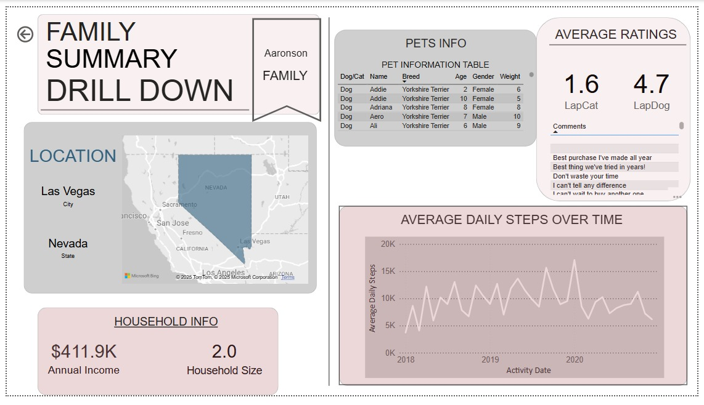

# Waggle

## Overview
The task here is to create a boardroom paginated report demo that tells the story of how Waggle's new product 'LapCat' compares to the original product 'LapDog' in its new expansion.

#### Business Requests 

The CEO is curious about the following questions:

* Did the average daily steps increase for cats wearing the device as they did for dogs?
* Were owners of Lapcat devices as satisfied with the product as Lapdog owners?

For the Company requirements, 

1. The Chief Marketing Officer would like the report to be “on-brand” by including only colors from the Waggle color palette, the Waggle logo, and other approved company logos and icons.
2. The product team would like to incorporate other visuals and insights as we see fit but is most interested in demographic comparisons between the dogs and cats using Waggle devices as well as any information about the families who own the pets
3. They would also like slicers to help them filter and explore on their own.

Unto the Design requirements,

1. Develop one or more visualizations that specifically address the CEO’s questions about whether there was a difference in average daily steps over time between the two devices and how Lapcat owners rated their device compared to Lapdog owners.
2. Address the product team’s request for demographic insights, using each of the following visuals at least once: Bar chart, line chart, donut chart, table/matrix, scatter plot, bubble map, and card.
3. Place data visualizations and design an appropriate layout that emphasizes the most important findings first, with the CEO's questions answered on the first page, insights about the differences between dogs and cats on the second, and insights about the families who own the pets on the third.
4. In the data visualizations, incorporate the branding elements requested by the Chief Marketing Officer.
5. Include at least five slicers on each page with at least one example of a drop-down slicer, at least one example of a slider slicer, at least one example of a hierarchy slicer, at least one example of a slicer with “Select All” enabled, and one example of a slicer with the search box enabled.
6. Create at least two bookmark features. One must allow users to dynamically swap one visual out with a different one and another must reset all applied filters on the page.
7. Create buttons that help your users navigate your report. Buttons must respond when users hover over them by changing color or size (or both!).

#### Data Model
The data model in its Star Schema form:

## Project Report
#### Home 

#### Pets Summary

#### Family Summary

#### Family Summary Drilldown

